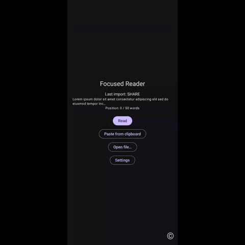

# Focused Reader (Android)

A focused, configurable RSVP (Rapid Serial Visual Presentation) speed-reader for Android. Share text from any app and read one word at a time at 100–400 WPM (or -100 to -1 in reverse), with the optimal recognition point (ORP) highlighted to keep your eyes still.



[](https://www.gnu.org/licenses/agpl-3.0)

## Features

- **RSVP engine** — one word per tick, 100–400 WPM forward, 0 = pause, -1 to -100 = reverse
- **ORP highlighting** — middle alphanumeric letter rendered in a contrast color, visually anchored at screen center for zero eye movement
- **Dynamic font sizing** — words scale to fill the screen, with per-word width clamp for very long words and per-bucket scaling (1–8 chars: full, 9–16: 80%, 17+: 60%)
- **Four accessibility-focused fonts** — OpenDyslexic, Lexend, Atkinson Hyperlegible, Inclusive Sans
- **Three text-capture paths**:
  - **Share intent** — system share sheet from any app
  - **Clipboard** — paste from any source while in the foreground
  - **File picker** — `.txt`, `.html`, `.md`
  - URLs are auto-detected and the page is fetched + extracted (HTML → readable text via Jsoup, plain-text short-circuit for `.txt` URLs)
- **Sensor pause/resume** — flip phone face-down to pause, face-up to resume (configurable, with 2-confirmation debounce to filter noise)
- **TTS integration** — speak each word in sync with the visual tick, with a calibration wizard that binary-searches the device's reliable WPM ceiling
- **Haptic feedback** — per-word or per-punctuation, intensity-scaled, USAGE_HARDWARE_FEEDBACK
- **Per-session persistence** — single-slot Room store: resume where you left off
- **Themes** — light/dark with selectable highlight colors
- **Document preview** — Pause overlay shows a scrollable rendering of the source text; tap any line to jump there
- **Volume keys** control speed live with an on-screen WPM HUD
- **Keep-screen-awake** toggle for long sessions

## WPM ceiling

The 400 WPM upper bound reflects peer-reviewed RSVP comprehension research (Rayner et al. 2016; Schotter et al. 2014): above ~400 WPM, comprehension drops sharply because the eye cannot re-fixate to recover missed words. Earlier versions allowed up to 900 WPM, which felt fast but discarded most of what you read.

## Build

Requires an Android SDK with platform 36 installed.

1. Copy `local.properties.example` to `local.properties` and set your SDK path:
   ```
   sdk.dir=/path/to/your/Android/Sdk
   ```
2. Build and install on a connected device:
   ```
   ./gradlew :app:installDebug
   ```
3. Unit tests:
   ```
   ./gradlew :app:testDebugUnitTest
   ```

Target: `minSdk 30`, `targetSdk 36`, Kotlin 2.0, Jetpack Compose, Hilt, Room, DataStore, Jsoup.

## Usage

1. **Import text**
   - Share from any app's Share sheet → "Focused Reader" (URLs are fetched + extracted automatically)
   - Or open Focused Reader, tap **Paste from clipboard**
   - Or tap **Open file…** and pick a local `.txt` / `.md` / `.html`
2. **Tap Read** to start playback in landscape
3. **Volume Up / Volume Down** adjusts WPM by the configured step
4. **Tap screen** to pause; **flip face-down** also pauses
5. In Pause overlay: scroll the document preview and tap any line to jump there, **Resume** to keep reading, **Stop** to end

## Settings

- **Speed** — WPM (-100 to 400) and step (5–50)
- **Pause / Resume** — resume countdown delay, face-down sensor toggle
- **Haptic** — off / per-word / per-punctuation, intensity 0–33%
- **TTS** — enable + WPM cap + Calibrate wizard
- **Theme** — light / dark / auto + highlight color
- **Display** — keep screen awake + font picker (4 fonts)

## Architecture

- `data/` — Room single-slot session + DataStore preferences
- `reader/` — RSVP engine, ORP calculator, WPM math, orientation/haptic/TTS controllers
- `capture/` — Share receiver, clipboard importer, file picker, Jsoup URL fetcher
- `ui/` — Compose screens (Home, Reader, Settings, TTS calibration) and theming
- `nav/` — Compose navigation graph
- `di/` — Hilt module

See `docs/superpowers/specs/2026-05-16-focused-reader-android-design.md` for the original design document and `docs/superpowers/plans/2026-05-16-focused-reader-android.md` for the implementation plan.

## Privacy

No data leaves your device. See [PRIVACY.md](docs/PRIVACY.md) for the full policy.

## License

This program is free software: you can redistribute it and/or modify it under the terms of the GNU Affero General Public License as published by the Free Software Foundation, version 3.

See [LICENSE](LICENSE) for the full text.
